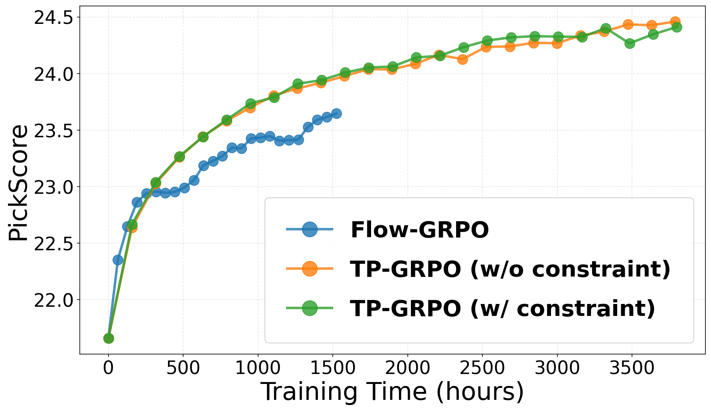

This anonymous repository provides the illustrations for ICML 2026 "Submission Alleviating Sparse Rewards by Modeling Step-Wise and Long-Term Sampling Effects in Flow-Based GRPO".

### Computation Cost Comparison

