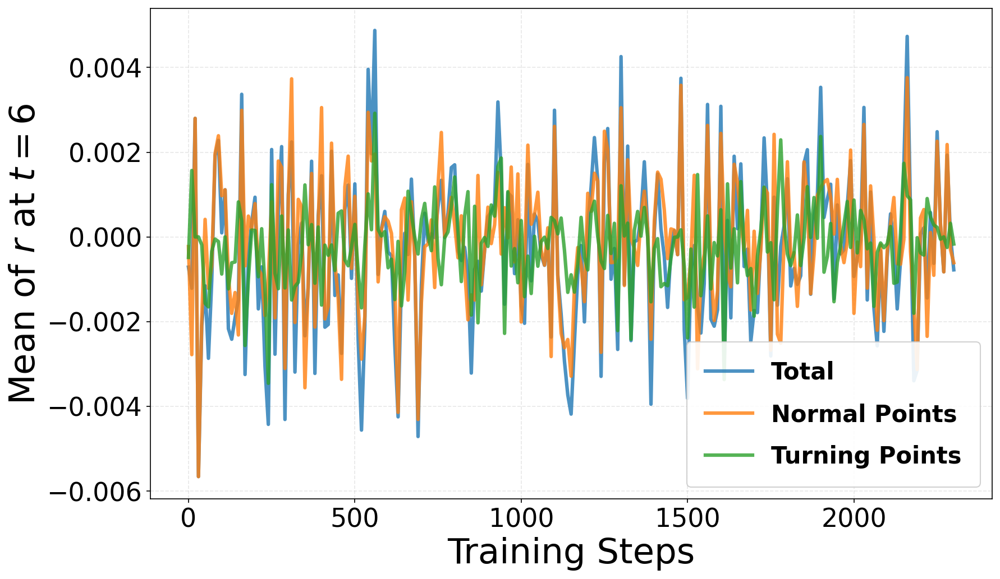
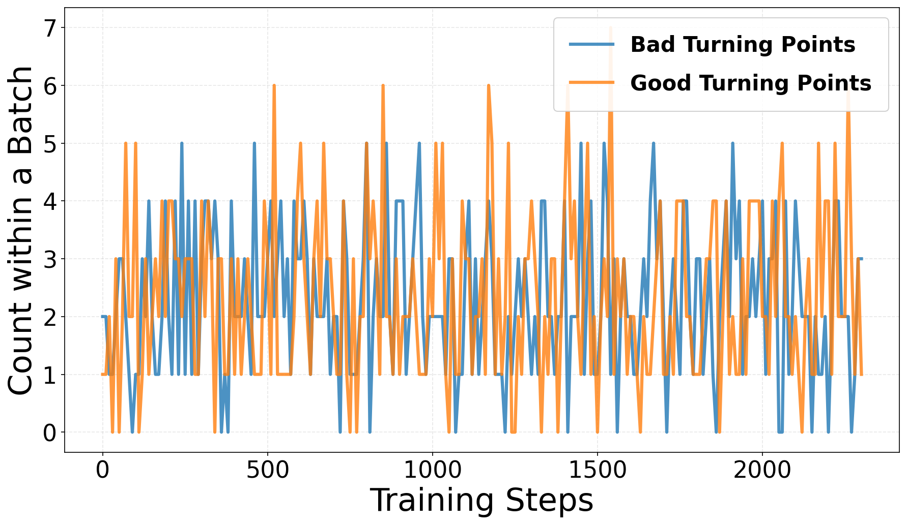

## Additional Materials for Reviewer dNJw

### [Q1] Computation Cost Comparison

The figure below visualizes the performance comparison over training time under a fixed number of training steps for Flow-GRPO and TP-GRPO.

### [Q2] Statictical Analysis of Turning Points

#### The dynamics of subtraction-based reward $r$ for normal points vs. turning points

The figure below shows the subtraction-based rewards $r _t$ and $r _t^\text{agg}$ at the intermediate step $t=6$, highlighting how turning points provide distinctive training signals compared to normal points.

#### Average count of good and bad turning points within a batch

The figure below shows the average count of both 'good' and 'bad' turning points within a batch of 36 samples during the training process.

### [Q3] Code

The implementation details and source code are available at: https://anonymous.4open.science/r/18EF/README.md.

---

Thanks for your detailed reviews and constructive suggestions. We will integrate these discussions into the final version of our manuscript :)